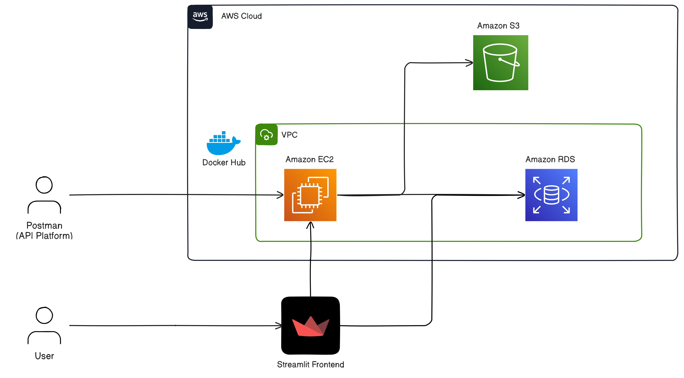

# Text Summarizer for Webinars

This repository encapsulates a demo of the final application and fine-tuned model with a comprehensive exploration into long document summarization in the context of multi-speaker webinar transcripts. Dive into my in-depth research report that navigates the complexities of long document summarization and evaluations of the current available open-source and closed-source models, along with my process of fine-tuning our very own summarization model on limited resources. As this repository doesn't contain any code for the evaluaion and fine-tuning of the models, I've collated some useful code snippets from my work [here](https://gist.github.com/jolenechong/0781431d894332ee44b7ef05caab7cbe).

Date: October-November 2023<br/>
Live site: https://llm-text-summarizer.streamlit.app/ (backend is terminated at this time)<br/>
Fine-Tuned Open Source Models:
- [LoRA Fine-Tuned CNN/DailyMail and TIB BART Large model](https://huggingface.co/jolenechong/lora-bart-cnn-tib-1024)<br/>
- [LoRA Fine-Tuned SAMSUM TIB BART Large model](https://huggingface.co/jolenechong/lora-bart-samsum-tib-1024)<br/>

Documentation: [Unleashing the Power of Large Language Models on Transcripts Summarization.pdf](https://github.com/jolenechong/textSummarizerLLMsApp/blob/main/Unleashing%20the%20Power%20of%20Large%20Language%20Models%20on%20Transcripts%20Summarization.pdf)<br/>
Code Snippets: [https://gist.github.com/jolenechong/0781431d894332ee44b7ef05caab7cbe](https://gist.github.com/jolenechong/0781431d894332ee44b7ef05caab7cbe)

Here's a quick demo on the summarization features of the application and how it works.<br/>

https://github.com/jolenechong/textSummarizerLLMsApp/assets/77100254/3dbea24c-ad10-48b7-8911-ca7266f127c8

<br/>

### Architecture



### Usage

Give this model a try! It's the second published model as stated above. <br/>
Here's how to use it:
```python
# install these libraries if you haven't already
# !pip install transformers
# !pip install peft

from peft import PeftModel, PeftConfig
from transformers import AutoModelForSeq2SeqLM, AutoTokenizer

config = PeftConfig.from_pretrained("jolenechong/lora-bart-samsum-tib-1024")
model = AutoModelForSeq2SeqLM.from_pretrained("philschmid/bart-large-cnn-samsum")
model = PeftModel.from_pretrained(model, "jolenechong/lora-bart-samsum-tib-1024")
tokenizer = AutoTokenizer.from_pretrained("jolenechong/lora-bart-samsum-tib-1024", from_pt=True)

text = """[add transcript you want to summarize here]"""
inputs = tokenizer(text, return_tensors="pt")

with torch.no_grad():
    outputs = model.generate(input_ids=inputs["input_ids"])
    print(tokenizer.batch_decode(outputs.detach().cpu().numpy())[0])

```

Feel free to check out the process through my documentation and code snippets as well as the first model above for more details on the fine-tuning process and the evaluation of the models.

To run the front-end streamlit application locally, follow these steps:
```bash
# create virtual environment
py -m venv ".venv"
cd .venv/Scripts
activate.bat # for windows
source .venv/Scripts/activate # for linux

# install relevant libraries
pip install -r requirements.txt

# initializing db
# might need to set up listen_addresses in postgresql.conf file to 'localhost' if it's your first time running it
py
from app import app, db
app.app_context().push()
db.create_all()

# frontend
streamlit run streamlit-app.py
```


### Contact
Jolene - [jolenechong7@gmail.com](mailto:jolenechong7@gmail.com) <br>
